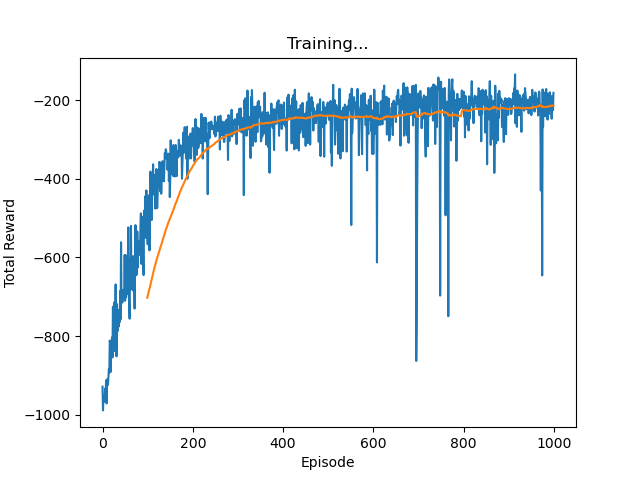
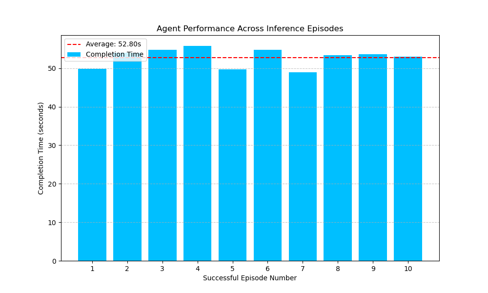

# DQN for Autonomous Highway Driving in SUMO

This repository contains the implementation of a Deep Q-Network (DQN) agent trained for autonomous driving on a simulated highway. Using the [SUMO (Simulation of Urban MObility)](https://www.eclipse.org/sumo/) traffic simulator, the agent learns to navigate a multi-lane environment by balancing the objectives of maintaining a target speed and avoiding collisions.

This project covers an end-to-end reinforcement learning workflow, from environment design and agent training to quantitative performance evaluation.

---

## Project Overview

- **Environment**: [SUMO (Simulation of Urban MObility)](https://www.eclipse.org/sumo/)
- **Algorithm**: Deep Q-Network (DQN) with Experience Replay and a Target Network
- **Framework**: [PyTorch](https://pytorch.org/)

---

## Key Features

### Custom SUMO Highway Environment
A 1000-meter, two-lane highway dynamically populated with human-driven vehicles and a single controllable ego agent.

### Rich State Representation
The agent observes a 14-dimensional state vector capturing its own kinematics (speed, lane) and its spatial relationship to the nearest vehicles (front, rear, and adjacent lanes).

### Discrete Action Space
The agent selects from five distinct driving actions:
- Maintain Speed
- Accelerate
- Decelerate
- Change Lane Left
- Change Lane Right

###  Engineered Reward Function
A carefully designed reward function encourages target-speed driving (30 m/s) while heavily penalizing unsafe behavior:

- **Collision**: `-10`
- **Near-collision (Time-to-Collision < 1s)**: `-1`
- **Speed Deviation**: A continuous penalty proportional to the deviation from the target speed.

---

## Results

### Training Performance
The agent was trained for 1,000 episodes, successfully learning a stable driving policy. The learning curve below shows the total reward per episode, with a 100-episode moving average (orange) clearly illustrating convergence as the reward plateaus.



### Inference Performance
The final trained agent was evaluated over 10 episodes in deterministic inference mode (no random actions). The agent demonstrated robust performance, successfully completing all episodes without collisions. The bar chart shows the time taken to complete each run.



The trained model weights (`dqn_highway_model.pth`) are available in the **[v1.0.0 Release](https://github.com/AymaneHassini/sumo-dqn-highway-driving/releases/tag/v1.0.0)**.

---

## Getting Started

Follow these instructions to set up the environment and run the project on your local machine.

### Prerequisites

*   [**Python 3.8+**](https://www.python.org/)
*   [**Conda**](https://docs.conda.io/en/latest/miniconda.html) for environment management.
*   [**SUMO**](https://sumo.dlr.de/docs/Downloads.php): Ensure that the `SUMO_HOME` environment variable is set correctly after installation.

## Installation & Setup

The setup process is straightforward. The required Conda environment can be created from the provided `environment.yml` file.

```bash
# 1. Clone the repository to your local machine
git clone https://github.com/AymaneHassini/sumo-dqn-highway-driving.git
cd sumo-dqn-highway-driving

# 2. Create and activate the conda environment
conda env create -f environment.yml
conda activate aims_rl
```
## Usage

This project includes scripts for both training a new agent and evaluating the provided pre-trained model.

### 1. Evaluate the Pre-Trained Model (Inference)

To see the final agent in action, you can run it in inference mode. This will load the pre-trained weights and test the agent's performance over 10 episodes with randomized traffic.

**Steps:**

1.  **Download the Model:** Download the `dqn_highway_model.pth` file from the **[v1.0.0 Release](https://github.com/AymaneHassini/sumo-dqn-highway-driving/releases/tag/v1.0.0)**.

2.  **Place the Model:** Move the downloaded `.pth` file into the root directory of this project.

3.  **Run the Inference Script:** Execute the following command in your terminal:
    ```bash
    python inference.py
    ```

This script will launch the SUMO GUI, run the 10 evaluation episodes, and generate the performance plot `inference_performance.png`.

---

### 2. Train a New Agent from Scratch

If you wish to run the entire training pipeline yourself, you can use the training script.

**Steps:**

1.  **Run the Training Script:** Execute the following command:
    ```bash
    python dqn_train.py
    ```

**Expected Outcome:**
*   The script will run for 1,000 episodes. A live plot will show the reward progression.
*   Upon completion, the script will save two files:
    1.  `dqn_highway_model.pth`: The newly trained model weights.
    2.  `training_rewards_plot.png`: The final plot of the training curve.

**Note:** For faster training, you can edit `dqn_train.py` and change the `SUMO_BINARY` variable from `"sumo-gui"` to `"sumo"`. This will run the simulation without the graphical interface.